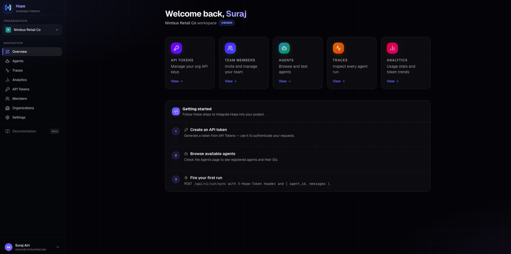
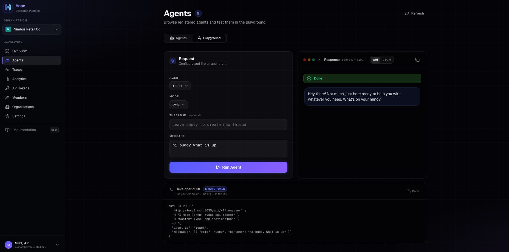
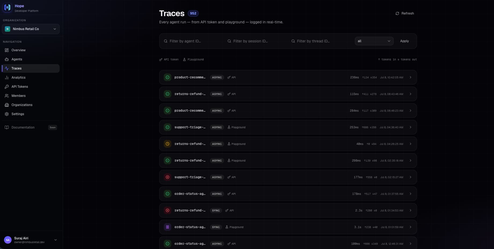
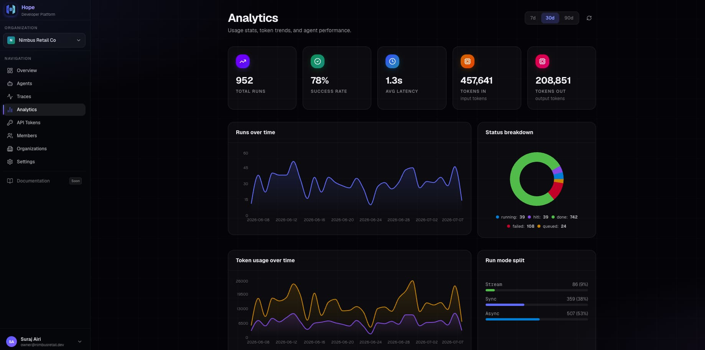

<h1 align="center">
  <br />
  Hope — Agent Service Platform
</h1>

<p align="center">
  A production-grade, multi-tenant AI agent infrastructure platform. Deploy, run, monitor, and bill LLM-powered agents at scale.
</p>

<p align="center">
  
</p>

---

## Table of Contents

- [Overview](#overview)
- [Screenshots](#screenshots)
- [Architecture](#architecture)
  - [Layer Hierarchy](#layer-hierarchy)
  - [Flow Hierarchy](#flow-hierarchy)
  - [Execution Flow](#execution-flow)
- [Monorepo Structure](#monorepo-structure)
- [Tech Stack](#tech-stack)
- [Getting Started](#getting-started)
  - [Prerequisites](#prerequisites)
  - [Installation](#installation)
  - [Infrastructure](#infrastructure)
  - [Running Locally](#running-locally)
- [Key Concepts](#key-concepts)
- [API Reference](#api-reference)
- [Design Principles](#design-principles)
- [Roadmap](#roadmap)

---

## Overview

**Hope** is a full-stack agent execution platform built for teams who want to deploy, manage, and observe AI agents in production. It provides:

- **Multi-tenant isolation** — Organizations, members, and role-based access
- **Flexible execution modes** — Sync, async, and streaming agent runs
- **Full observability** — Real-time traces for every agent invocation
- **Usage analytics** — Token consumption, latency, and run status breakdowns
- **API-first design** — Authenticate via API tokens and integrate with any system
- **Built-in billing** — Per-step credit tracking with budget enforcement

The platform is split into a **Node.js API** (auth, routing, rate limiting), a **Python GenAI runner** (FastAPI + Agent SDK + Engine), and a **Next.js developer dashboard** (playground, traces, analytics).

---

## Screenshots

<table>
  <tr>
    <td align="center"><strong>Dashboard</strong></td>
    <td align="center"><strong>Agent Playground</strong></td>
  </tr>
  <tr>
    <td></td>
    <td></td>
  </tr>
  <tr>
    <td align="center"><strong>Traces</strong></td>
    <td align="center"><strong>Analytics</strong></td>
  </tr>
  <tr>
    <td></td>
    <td></td>
  </tr>
</table>

---

## Architecture

### Layer Hierarchy

The platform is composed of four clearly separated layers, each owning distinct responsibilities:

```
┌──────────────────────────────────────────────────────────────────┐
│                   NODE.JS  (Main Backend)                        │
│  User-facing: auth, rate limiting, routing, org management       │
│  Decides: stream=True/False based on request type                │
│  Calls the deployed Runner (internal FastAPI worker)             │
└───────────────────────────┬──────────────────────────────────────┘
                             │ HTTP (stream flag passed here)
┌───────────────────────────▼──────────────────────────────────────┐
│          DEPLOYED RUNNER INSTANCE  (FastAPI / Worker)            │
│                                                                  │
│  Streamer — smart lifecycle (opens/closes per .stream() call)    │
│  Credentials for Redis, DB, S3 configured at this level          │
│                                                                  │
│  ┌────────────────────────────────────────────────────────────┐  │
│  │                  RUNNER FRAMEWORK                          │  │
│  │  1. Creates: Redis, DB, S3 clients                         │  │
│  │  2. Creates: Engine(redis, db, s3)  — singleton            │  │
│  │                                                            │  │
│  │  On Agent Run Trigger:                                     │  │
│  │    Injects into ALL AgentCaller instances:                 │  │
│  │      caller._usage_tracker = engine.usage_tracker          │  │
│  │      caller._streamer      = streamer                      │  │
│  └────────────────────────────────────────────────────────────┘  │
└───────────────────────────┬──────────────────────────────────────┘
                             │ trigger(idem_key, stream, agent_id, …)
┌───────────────────────────▼──────────────────────────────────────┐
│                     ENGINE  [singleton]                          │
│                                                                  │
│  Components:                                                     │
│    ExecutionManager  — status (Redis), checkpoint/restore        │
│    BillManager       — budget tracking  (NEVER leaves Engine)    │
│    UsageTracker      — logging only, exposed as usage_tracker    │
│    ErrorHandler      — alerts platform + developer on errors     │
└───────────────────────────┬──────────────────────────────────────┘
                             │ calls
┌───────────────────────────▼──────────────────────────────────────┐
│                       AGENT SDK                                  │
│  Infra-agnostic agent logic.                                     │
│  Knows only: UsageTracker interface, Streamer interface          │
│                                                                  │
│  ResumeCheck   — template method pattern                         │
│  ExecutionStep — one loop iteration                              │
│  AgentRunner   — (AgentCaller)                                   │
│  AgentContext  — aggregator; ToolCaller lives here               │
└──────────────────────────────────────────────────────────────────┘
```

See the full architecture diagrams in the [`arch/`](arch/) directory:

| Diagram | Description |
|---------|-------------|
| [diagram-1.png](arch/diagram-1.png) | Layer hierarchy & component wiring |
| [diagarm-2.png](arch/diagarm-2.png) | Engine internals & execution loop |
| [diagram-3.png](arch/diagram-3.png) | Agent code, runner wiring, and Node.js bridge |

### Flow Hierarchy

```
Org     → billing, team, members
Agent   → what you deploy (config, tools, system prompt)
Thread  → conversation continuity, message history
Session → one job lifecycle, status tracking, idem_key
Run     → one loop iteration (ExecutionStep.run())
Step    → one AgentCaller.invoke() — per-LLM-call billing & debugging
```

- **Engine** is responsible for running the Agent and each execution run.
- **Runner** is responsible for fetching the agent and triggering the session.

### Execution Flow

```
TRIGGER (idem_key, stream, agent_id, messages, webhook, …)
    │
    ▼
RESUME CHECK
    ├─ status == hitl       → load HITL actions; block or continue
    ├─ status == created    → initial_work() (load project context)
    ├─ status == other      → resume_work() (checkpoint restore)
    └─ status != done       → before_run() → Engine sets status=WIP
                                   │
                                   ▼
EXECUTION LOOP  (only if status == WIP)
    ├─ [1] Bill check → stop if budget exceeded
    ├─ [2] Check for interrupt / HITL → break
    ├─ [3] ExecutionStep.run() → Agent SDK invokes LLM + tools
    ├─ [4] Periodic checkpoint dump to Redis (every N iterations)
    └─ Break on: completion / error / interruption / HITL
                                   │
                                   ▼
POST EXECUTION
    ├─ On error  → Engine triggers alert via ErrorHandler
    └─ On finish → set status (done / fail)
                → Dump remaining data: Redis → S3
                → Write metadata to DB
                → Send webhooks (if configured)
```

---

## Monorepo Structure

This is a **pnpm + Turborepo** monorepo containing both JavaScript/TypeScript and Python workspaces.

```
agent_service/
├── apps/
│   ├── api/          # Node.js (Express 5) — auth, routing, org management
│   ├── client/       # Next.js — developer dashboard (playground, traces, analytics)
│   └── genai/        # Python (FastAPI) — agent runner and agent definitions
│
├── packages/
│   ├── agent-sdk/    # Python — core agent primitives (AgentCaller, ResumeCheck, …)
│   ├── engine/       # Python — singleton engine (ExecutionManager, BillManager, …)
│   └── runner/       # Python — runner framework (infra creation, injection)
│
├── arch/             # Architecture diagrams and design reference docs
├── screenshots/      # UI screenshots
├── docker-compose.yml
├── turbo.json
├── pnpm-workspace.yaml
└── pyproject.toml
```

---

## Tech Stack

### Backend — API (`apps/api`)

| Layer | Technology |
|-------|-----------|
| Runtime | Node.js ≥ 18, TypeScript |
| Framework | Express 5 |
| Database ORM | Drizzle ORM |
| Database | PostgreSQL 17 |
| Cache / State | Redis 7 (ioredis) |
| Auth | JWT (jsonwebtoken) + bcrypt |
| Validation | Zod |
| API Docs | Swagger / OpenAPI |

### GenAI Runner (`apps/genai` + Python packages)

| Layer | Technology |
|-------|-----------|
| Runtime | Python ≥ 3.12 |
| Framework | FastAPI + Uvicorn |
| LLM Abstraction | LiteLLM |
| Agent Framework | LangChain / LangGraph |
| Streaming | SSE-Starlette |
| Validation | Pydantic v2 |
| Object Storage | MinIO (S3-compatible) |

### Frontend — Client (`apps/client`)

| Layer | Technology |
|-------|-----------|
| Framework | Next.js (App Router) |
| Language | TypeScript |
| Styling | Tailwind CSS |
| State | Zustand |

### Infrastructure

| Service | Image / Version | Port |
|---------|----------------|------|
| PostgreSQL | `postgres:17` | 5433 |
| Redis | `redis:7-alpine` | 6379 |
| MinIO (S3) | `minio/minio:latest` | 9000 / 9001 |

### Monorepo Tooling

| Tool | Purpose |
|------|---------|
| Turborepo | Task orchestration & caching |
| pnpm workspaces | JS package management |
| uv | Python dependency management |
| Prettier | Code formatting |

---

## Getting Started

### Prerequisites

- **Node.js** ≥ 18
- **pnpm** 9.x — `npm install -g pnpm@9`
- **Python** ≥ 3.12
- **uv** — `pip install uv` or `curl -LsSf https://astral.sh/uv/install.sh | sh`
- **Docker & Docker Compose** — for infrastructure services

### Installation

```bash
# Clone the repository
git clone <repo-url>
cd agent_service

# Install all JavaScript/TypeScript dependencies
pnpm install

# Install Python dependencies (from workspace root)
uv sync
```

### Infrastructure

Start PostgreSQL, Redis, and MinIO using Docker Compose:

```bash
docker compose up -d
```

| Service | URL | Credentials |
|---------|-----|-------------|
| PostgreSQL | `localhost:5433` | user/pass: `postgres` |
| Redis | `localhost:6379` | — |
| MinIO S3 API | `localhost:9000` | — |
| MinIO Admin UI | `localhost:9001` | user/pass: `minioadmin` |

#### Database setup

```bash
# Generate and apply migrations
pnpm db:generate
pnpm db:migrate

# (Optional) Open Drizzle Studio
pnpm db:studio
```

#### Environment variables

Copy and fill in the environment files for each app:

```bash
# Node.js API
cp apps/api/.env.example apps/api/.env

# Python GenAI runner
cp apps/genai/.env.example apps/genai/.env
```

Key variables to configure:

| Variable | App | Description |
|----------|-----|-------------|
| `DATABASE_URL` | API | PostgreSQL connection string |
| `REDIS_URL` | API / GenAI | Redis connection string |
| `JWT_SECRET` | API | Secret for signing JWTs |
| `MINIO_ENDPOINT` | GenAI | MinIO / S3 endpoint |
| `OPENAI_API_KEY` | GenAI | LLM provider key (via LiteLLM) |
| `ANTHROPIC_API_KEY` | GenAI | Anthropic key (via LiteLLM) |

### Running Locally

Run all services in parallel using Turborepo:

```bash
pnpm dev
```

Or start each service individually:

```bash
# Node.js API  (default: http://localhost:3030)
cd apps/api && pnpm dev

# Python FastAPI runner (default: http://localhost:8000)
cd apps/genai && uvicorn main:app --reload

# Next.js client  (default: http://localhost:3000)
cd apps/client && pnpm dev
```

---

## Key Concepts

### AgentCaller

The abstract base class for any component that invokes an external resource (LLM, tool, connector). Children implement `_do_invoke` and optionally `_do_stream`. The public `invoke(stream=flag)` is the only entry point — callers outside the class never touch internal methods.

```python
class AgentCaller(ABC):
    _usage_tracker: UsageTracker | None = None  # injected by runner
    _streamer: Streamer | None = None           # injected by runner

    def invoke(self, config, ..., stream=False):
        # Routes to _handle_stream or _handle_invoke.
        # Always returns a clean final response.
        ...

    @abstractmethod
    def _do_invoke(self, config, ...): ...

    def _do_stream(self, config, ...):
        # Default: wraps _do_invoke as a single-chunk stream.
        # LLM callers override this for true streaming.
        yield self._do_invoke(config, ...)
```

### ResumeCheck — Template Method Pattern

Agents can customize pre-loop behaviour by overriding specific hooks without owning control flow. The Engine always drives the sequence.

```python
class ResumeCheck:
    def hitl_action(self, state) -> bool: ...  # handle HITL gates
    def initial_work(self, state): ...         # first-run setup
    def resume_work(self, state): ...          # checkpoint restore
    def before_run(self, state): ...           # always fires before loop
```

### Execution Modes

| Mode | Behaviour |
|------|-----------|
| `sync` | Block until complete, return full response |
| `async` | Return immediately; poll `/run/status/<id>` |
| `stream` | Server-Sent Events (SSE) token-by-token stream |

### Streaming Decision Chain

Streaming is an I/O concern, not an agent logic concern. The decision flows strictly top-down and the Agent SDK never decides it:

```
User Request
  → Node.js  (decides stream=True/False from request type)
    → Runner  (passes stream flag in trigger)
      → Engine  (passes to ExecutionStep)
        → Agent SDK  (invoke called with stream=flag — does not decide)
```

### BillManager

- Created by Engine internally; **never exposed outside Engine**
- Uses Redis for synchronization across iterations (eventual consistency; accepted overshoot)
- Engine calls `bill_check()` at the top of **every** execution loop iteration
- `UsageTracker` is the only billing-adjacent object that leaves Engine (as `engine.usage_tracker`)

---

## API Reference

Interactive Swagger docs are available at [`http://localhost:3030/api-docs`](http://localhost:3030/api-docs) when the API is running.

### Authentication

All API requests (except auth endpoints) require an `X-Hope-Token` header:

```
X-Hope-Token: <your-api-token>
```

Generate tokens from the **API Tokens** section of the dashboard.

### Core Endpoints

| Method | Path | Description |
|--------|------|-------------|
| `POST` | `/api/v1/run/sync` | Run agent synchronously |
| `POST` | `/api/v1/run/async` | Run agent asynchronously |
| `POST` | `/api/v1/run/stream` | Run agent with SSE streaming |
| `GET` | `/api/v1/run/status/:id` | Poll status of an async run |
| `GET` | `/api/v1/run/:id` | Get full response of a completed run |

### Quick Start — cURL

```bash
curl -X POST 'http://localhost:3030/api/v1/run/sync' \
  -H 'X-Hope-Token: <your-api-token>' \
  -H 'Content-Type: application/json' \
  -d '{
    "agent_id": "react",
    "messages": [{ "role": "user", "content": "Hello!" }]
  }'
```

---

## Design Principles

These rules are non-negotiable in the codebase:

1. **Engine is a singleton.** Never recreated per request.
2. **BillManager never leaves Engine.** Not injected, not exposed to callers.
3. **Engine does not create infrastructure.** `redis`, `db`, and `s3` clients come from the Runner.
4. **AgentCaller children never implement public `invoke`.** Only `_do_invoke` and optionally `_do_stream`.
5. **Streaming decision flows top-down.** Agent SDK never decides whether to stream.
6. **AgentContext is an aggregator, never an AgentCaller.** Tools belong to `ToolCaller`, not `AgentContext`.
7. **On any AgentCaller failure:** log usage (no charge), re-raise. Engine's `ErrorHandler` triggers the alert.
8. **Connector and ToolCaller own idempotency and deduplication** of their own calls.

---

## Roadmap

### V1 — Current

- [x] Engine (ExecutionManager, BillManager, UsageTracker, ErrorHandler)
- [x] Runner (FastAPI, infra creation, dependency injection)
- [x] AgentRunner (AgentCaller)
- [x] ToolCaller (AgentCaller)
- [x] Streamer (smart lifecycle)
- [x] ResumeCheck (default + agent override)
- [x] ExecutionStep
- [x] Checkpoint / restore (Redis)
- [x] Webhook on completion
- [x] Developer dashboard (playground, traces, analytics)
- [x] Multi-tenant org management

### V2 — Planned

- [ ] ConnectorCaller
- [ ] RAGConnector
- [ ] MemoryManager
- [ ] Skills system
- [ ] Artifacts
- [ ] Retry queue for webhooks
- [ ] Cross-session context (project-level message history)

---

## License

MIT — see [LICENSE](apps/genai/LICENSE) for details.